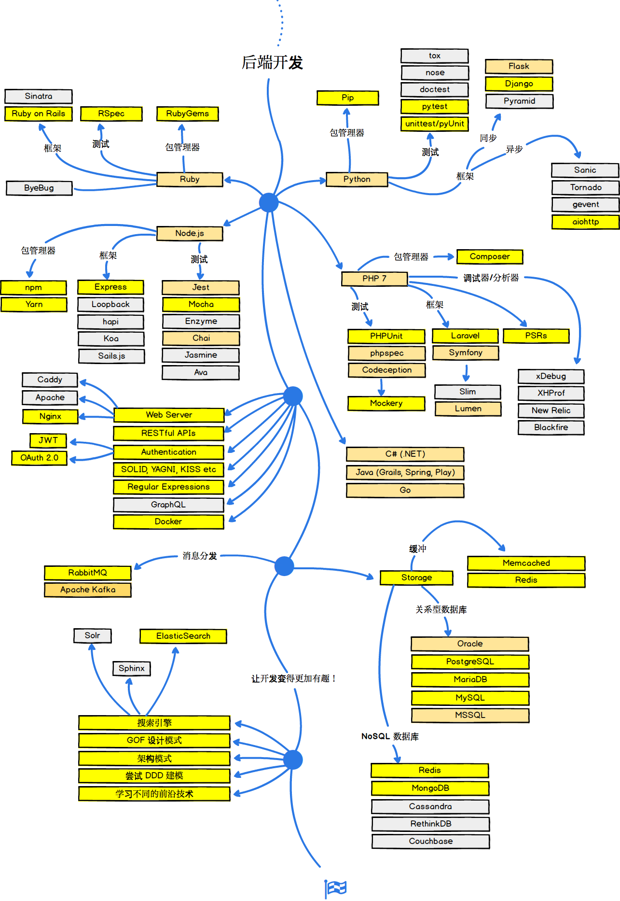

## Web 开发路线图

2018 年，如何成为一名优秀的开发者？

如果你认为这些仍需完善，请给我们提供 [反馈](https://github.com/oss-labs/developer-roadmap/issues/new) 。

***

Web 前端

***

## 🚀 准备开始

## 🎨 前端开发

## 👽 后端开发

对于后端而言，我个人更喜欢 Node.js 和 PHP 7 。另外，我最近一直在尝试 Go 语言，并且我非常喜欢它。除此之外，如果让我不得不选择另外一门语言的话，我会选择 Ruby 。不过，这只是我个人的喜好，你可以选择任何一种你擅长的语言。

## 👷 DevOps

## 许可协议

