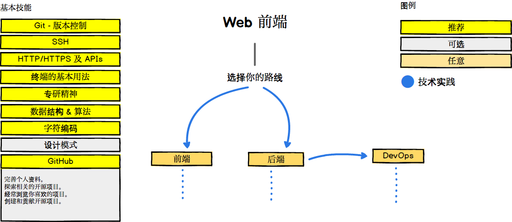

## 开发路线图

2018 年，如何成为一名优秀的开发者？

如果你认为这些仍需完善，请给我们提供 [反馈](https://github.com/oss-labs/developer-roadmap/issues) 。

***

Web 前端

***

## 🚀 准备开始

## 🎨 前端开发

## 👽 后端开发

For the backend, personally I would prefer Node.js and PHP 7 for the full time. Plus, I have been experimenting lately with Go and I quite like it. Apart from these, if I have to choose another one, I would go for Ruby. However this is just my personal preference, you can choose any of the shown languages and you will be good.

## 👷 DevOps

 

## 🚦 Wrap Up

If you think any of the roadmaps can be improved, please do open a PR with any updates and submit any issues. Also, I will continue to improve this, so you might want to watch/star this repository to revisit.

## ☑ TODO

- [X] Add Frontend Roadmap
- [X] Add Backend Roadmap
- [X] Add DevOps Roadmap
- [ ] Add relevant resources for each

## 👬 Contribution

The roadmaps are built using [Balsamiq](https://balsamiq.com/products/mockups/). Project file can be found at `/project-files` directory. To modify any of the roadmaps, open Balsamiq, click **Project > Import > Mockup JSON**, it will open the roadmap for you, update it, upload and update the images in readme and create a PR.		

- Open pull request with improvements
- Discuss ideas in issues
- Spread the word
- Reach out with any feedback 

## Sponsored By

- [Hackr.io - Find & Share the Best Online Programming Courses & Tutorials](https://hackr.io)
- [Highig - Think and its done](http://highig.com/)

## License

